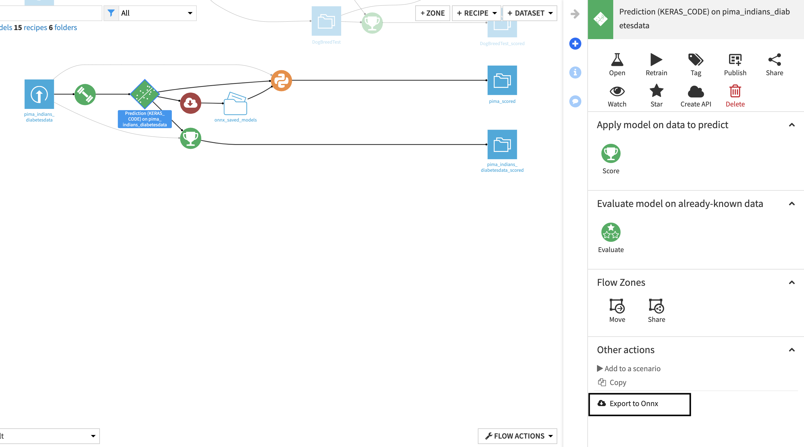
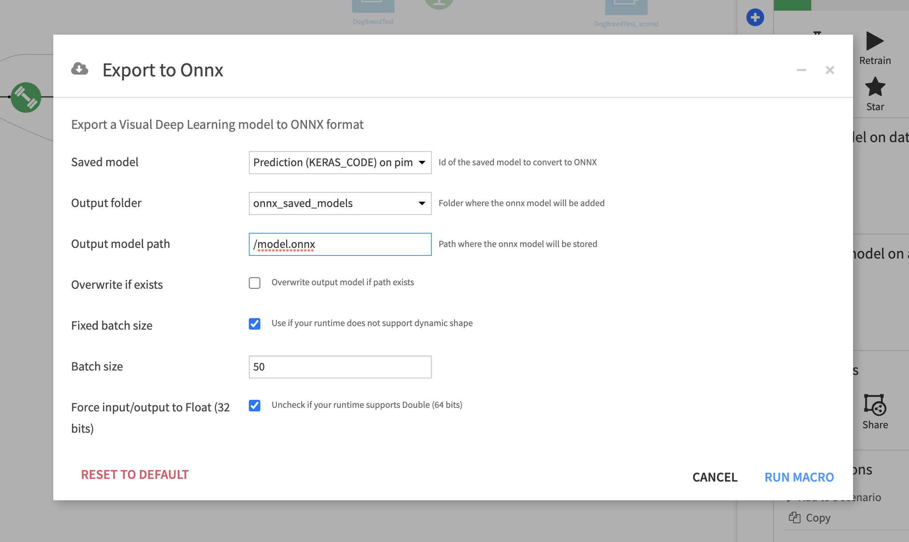
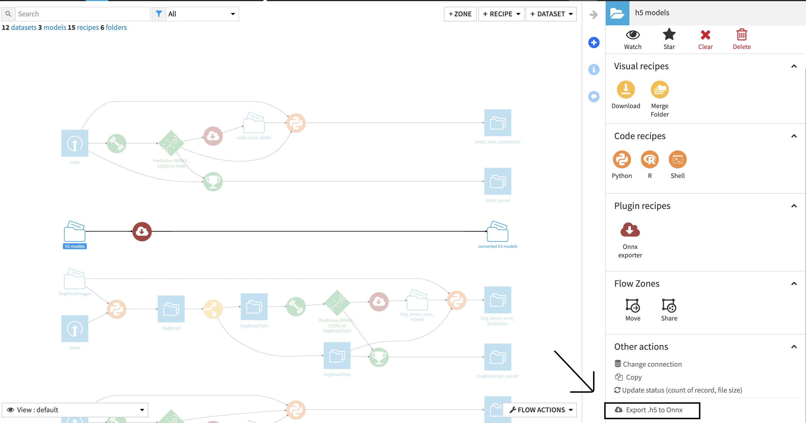
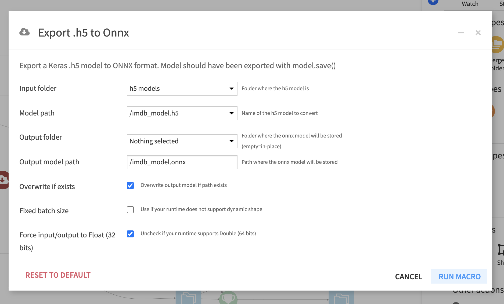
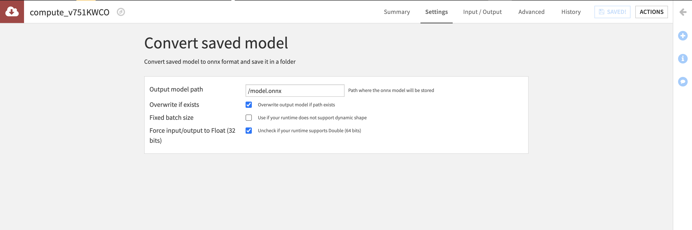
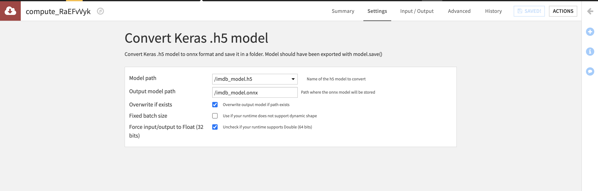

# Dataiku DSS ONNX exporter Plugin

With this Dataiku DSS plugin one can export `Visual Deep Learning` and `Keras .h5 models` to ONNX format

## What is ONNX ?

ONNX is an open format built to represent machine learning models. ONNX defines a common set of operators - the building blocks of machine learning and deep learning models - and a common file format 
to enable AI developers to use models with a variety of frameworks, tools, runtimes, and compilers. [More info here](https://onnx.ai/about.html)

## Why use this plugin ?

This plugin aims at offering an easy way to deploy Deep learning models to various machines and environments with the onnx runtime. 
You can learn about all the languages, architectures and hardware acceleration supported by onnx runtime [here](https://microsoft.github.io/onnxruntime/)

## Description

This DSS plugin offers the conversion of two kinds of models:
* Visual Deep Learning models trained with DSS 
* Keras `.h5 models`. 

This plugin contains one recipe and one macro for each conversion type.

Visual Deep Learning models trained with DSS: 
- [Convert saved model to onnx macro](#convert-saved-model-to-onnx-macro)
- [Convert saved model to onnx recipe](#convert-saved-model-to-onnx-recipe)

Keras `.h5 models`:
- [Convert Keras .h5 model to onnx macro](#convert-keras-h5-model-to-onnx-macro)
- [Convert Keras .h5 model to onnx recipe](#convert-keras-h5-model-to-onnx-recipe)

## How to use the Macros ?

### Convert saved model to onnx macro

1. (If you don't already have one) create a DSS python3 code env 
with the following packages (ie packages needed for Visual Deep Learning with keras == 2.1.6):
```tensorflow==1.8.0
keras==2.1.6
scikit-learn>=0.20,<0.21
scipy>=1.1,<1.2
statsmodels>=0.9,<0.10
jinja2>=2.10,<2.11
flask>=1.0,<1.1
h5py==2.7.1
pillow==5.1.0
```

2. Train a Visual Deep learning model in DSS with this code env. [Here](https://academy.dataiku.com/introduction-to-deep-learning-with-code-open/513277) is a tutorial
3. Install this plugin
4. Go the flow
5. Click on the saved model
6. In the right panel in the `other actions section`, click on `Export to ONNX` 



7. Fill in the parameters (details below) 



8. Click on `RUN MACRO`
9. Click on `Download onnx model` to trigger the download. The model has also been added to the output folder #TODO add image 

#### Available parameters

- `Saved model` (DSS saved model): Visual Deep Learning model trained in DSS to convert
- `Output folder` (DSS managed folder): Folder where the onnx model will be added
- `Output model path` (String): Path where the onnx model will be stored
- `Overwrite if exists` (boolean): Whether the model should overwrite the existing file at same path (if it already exists)
- `Fixed batch size` (boolean): Some runtimes do not support dynamic batch size and thereefore the size should be specified during export.
- `Batch size` (int) [optional]: Batch size of the model's input
- `Force input/output to Float (32 bits)` (int): Some runtimes do not support `Double`. Uncheck if your runtime supports `Double`

### Convert Keras .h5 model to onnx macro

1. Put a .h5 model file obtained through Keras's model.save() method into a DSS Managed Folder
2. Go to flow
3. Click on the folder 
4. In the right panel in the `other actions section`, click on `Export .h5 to ONNX` 



5. Fill in the parameters (details below) 




6. Click on `RUN MACRO`
7. Click on `Download onnx model` to trigger the download. The model has also been added to the output folder #TODO add image 

#### Available parameters

- `Input folder` (DSS managed folder): Folder where the .h5 model is
- `Model path`(String): Path to the .h5 model to convert
- `Output folder` (DSS managed folder) [optional]: Folder where the onnx model will be added. 
If `Output folder` is left empty the model is added to the input folder.
- `Output model path` (String): Path where the onnx model will be stored
- `Overwrite if exists` (boolean): Whether the model should overwrite the existing file at same path (if it already exists)
- `Fixed batch size` (boolean): Some runtimes do not support dynamic batch size and thereefore the size should be specified during export.
- `Batch size` (int) [optional]: Batch size of the model's input
- `Force input/output to Float (32 bits)` (int): Some runtimes do not support `Double`. Uncheck if your runtime supports `Double`

The macros are also available in the `Macro` menu of a project.

## How to use the Recipes ?

### Convert saved model to onnx recipe

1. Create (if you don't already have one) a DSS python3 code env 
with the following packages (ie packages needed for Visual Deep Learning with keras == 2.1.6):
```tensorflow==1.8.0
keras==2.1.6
scikit-learn>=0.20,<0.21
scipy>=1.1,<1.2
statsmodels>=0.9,<0.10
jinja2>=2.10,<2.11
flask>=1.0,<1.1
h5py==2.7.1
pillow==5.1.0
```

2. Train a Visual Deep learning model in DSS with this code env
3. Create a managed folder by clicking on `+ DATASET > Folder`
4. Install this plugin
5. Go the flow
6. Click on the `+ RECIPE > ONNX exporter` button
7. Click on the `Convert saved model` option in the modal
8. Choose the saved model you just trained as input and the folder you created as output
9. Fill in the parameters on the recipe page (details below) 




#### Available parameters

- `Output model path` (String): Path where the onnx model will be stored
- `Overwrite if exists` (boolean): Whether the model should overwrite the existing file at same path (if it already exists)
- `Fixed batch size` (boolean): Some runtimes do not support dynamic batch size and thereefore the size should be specified during export.
- `Batch size` (int) [optional]: Batch size of the model's input
- `Force input/output to Float (32 bits)` (int): Some runtimes do not support `Double`. Uncheck if your runtime supports `Double`

### Convert Keras .h5 model to onnx recipe

1. Put a .h5 model file obtained through Keras's model.save() method into a DSS Managed Folder
2. Go to flow
3. Click on the folder 
4. In the right panel in the Plugin recipes section, click on `ONNX exporter` #TODO add image 
5. Click on the `Convert Keras .h5 model` option in the modal
5. Fill in the parameters (details below) 



#### Available parameters

- `Model path`(String): Path to the .h5 model to convert
- `Output folder` (DSS managed folder) [optional]: Folder where the onnx model will be added. 
If `Output folder` is left empty the model is added to the input folder.
- `Output model path` (String): Path where the onnx model will be stored
- `Overwrite if exists` (boolean): Whether the model should overwrite the existing file at same path (if it already exists)
- `Fixed batch size` (boolean): Some runtimes do not support dynamic batch size and thereefore the size should be specified during export.
- `Batch size` (int) [optional]: Batch size of the model's input
- `Force input/output to Float (32 bits)` (int): Some runtimes do not support `Double`. Uncheck if your runtime supports `Double`
